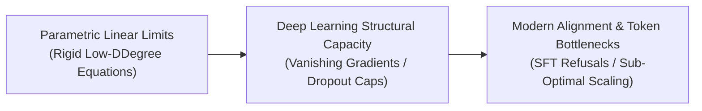

# Awesome-Underfitting
## Underfitting in AI: Evolution, Variants, Types, & Applications

Underfitting is a foundational phenomenon in artificial intelligence and machine learning that occurs when a model is unable to capture the underlying structure of the training data. This happens because the model is structurally too simple, or the training process is too constrained, to learn the complex mathematical relationships mapping inputs to outputs. An underfit model exhibits high bias and low variance, resulting in poor performance on both the training dataset and unseen validation data. Over the evolution of AI, understanding and diagnosing underfitting has shifted from tuning simple parametric statistical boundaries to managing massive foundation models constrained by training bottlenecks, token filtering regimes, and safety boundaries.

---

## 1. The Chronological Evolution

The manifestation and mitigation of underfitting have transitioned from basic linear parameter tracking to complex structural capacity bottlenecks in multi-billion parameter foundation architectures.

| Era / Concept | Description | Year | First Used / Paper Link |
| :--- | :--- | :--- | :--- |
| **The Parametric Linear Limits Era (Traditional ML)** | Underfitting was primarily caused by using rigid, low-degree equations (like linear regression or simple logistic models) to solve highly complex, non-linear real-world problems. The algorithm lacked the geometric flexibility to trace curved data boundaries, flatlining at low training and testing accuracy. | 1992 | [Neural Networks and the Bias/Variance Dilemma](https://direct.mit.edu/neco/article-abstract/4/1/1/5797/Neural-Networks-and-the-Bias-Variance-Dilemma) |
| **The Deep Learning Structural Capacity Era (~2012–2020)** | Unlocked by deep neural networks. As architectures scaled, underfitting mutated from simple equation constraints to optimization constraints. Models underfit because of **Vanishing Gradients**, sub-optimal hyperparameter settings (like excessively high learning rates), or overly aggressive regularization techniques (such as massive Dropout rates) that starved the hidden layers of representational capacity. | 2012 | [Improving neural networks by preventing co-adaptation of feature detectors](https://arxiv.org/abs/1207.0580) |
| **The Modern Alignment & Foundation Scaling Era (~2021–Present)** | The current frontier state-of-the-art paradigm. Multi-billion parameter frontier models generally possess immense native capacity, yet they can still exhibit specialized forms of underfitting. This occurs when a model undergoes sub-optimal pre-training relative to its compute budget, is starved by aggressive token-filtering regimes, or experiences **Alignment-Induced Underfitting**—where tight safety guardrails during Supervised Fine-Tuning (SFT) force the model to over-simplify or completely refuse complex, benign prompts. | 2022 | [Training language models to follow instructions with human feedback](https://arxiv.org/abs/2203.02155) |

---

## 2. Core Functional & Optimization Variants

Underfitting manifests through distinct mathematical and structural anomalies across the neural network optimization pipeline.

| Variant | Mechanism | Year | First Used / Paper Link |
| :--- | :--- | :--- | :--- |
| **Structural Capacity Underfitting** | The model's neural network graph is physically too small (insufficient hidden layers, narrow width parameters, or low head counts) to compress and map the complex feature representations present in the dataset. | 1989 | [Approximation by Superpositions of a Sigmoidal Function](https://link.springer.com/article/10.1007/BF02551274) |
| **Optimization-Driven Underfitting** | The model possesses adequate physical parameters on paper, but the optimizer fails to find a deep local minimum. This is typically driven by an poorly tuned learning rate scheduler, or initializing weights into dead zones, leaving the loss trajectory stalled on a flat plateau. | 1991 | [Untersuchungen zu dynamischen neuronalen Netzen](http://www.sepphochreiter.de/publications/diplom.pdf) |
| **Regularization-Induced Underfitting (Over-Regularization)** | Occurs when developers apply extreme parameter penalties—such as immense Weight Decay ($L_2$ regularization), aggressive Dropout rates ($>0.5$), or excessive data augmentation—that block the model from updating its weights flexibly, forcing it into an over-simplified operational state. | 2012 | [Improving neural networks by preventing co-adaptation of feature detectors](https://arxiv.org/abs/1207.0580) |

---

## 3. Data-Modality & Training Paradigm Manifestations

Depending on the input types and learning frameworks deployed across the enterprise stack, underfitting triggers specific behavioral failures.

| Manifestation | Behavior | Year | First Used / Paper Link |
| :--- | :--- | :--- | :--- |
| **Computer Vision Resolution Deficit** | Occurs when vision encoders are trained on drastically downsampled image patches (e.g., forcing $224 \times 224$ inputs). The model exhibits underfitting toward granular textual layouts or micro-anomalies because high-frequency spatial details are completely blurred out before feature extraction can happen. | 2020 | [An Image is Worth 16x16 Words: Transformers for Image Recognition at Scale](https://arxiv.org/abs/2010.11929) |
| **Natural Language Processing Representation Underfitting** | Occurs when a subword tokenizer fragments non-English languages or technical alpha-numeric codes into thousands of meaningless individual byte tokens. The language model core underfits the structural grammar rules because it cannot track semantic relationships over such massive token distances. | 2015 | [Neural Machine Translation of Rare Words with Subword Units](https://arxiv.org/abs/1508.07909) |
| **Reinforcement Learning Policy Convergence Stalls** | In RL frameworks (like PPO or TRPO), setting an excessively conservative trust-region constraint or setting the clipping window too narrow stops the model from exploring alternative, high-yield action trajectories, causing it to underfit the optimal environment policy path. | 2017 | [Proximal Policy Optimization Algorithms](https://arxiv.org/abs/1707.06347) |

---

## 4. Production Diagnostics & Mitigation Protocols

Detecting and repairing underfitting inside live commercial model-building infrastructure requires balancing architecture profiling with computational schedules.

| Protocol / Concept | Description / Mechanism | Year | First Used / Paper Link |
| :--- | :--- | :--- | :--- |
| **The Bias-Variance Diagnostic Matrix** | A production team tracks model metrics and observes a high training error that closely matches the validation error. This signature definitively proves the presence of underfitting, ruling out overfitting patterns. | 1992 | [Neural Networks and the Bias/Variance Dilemma](https://direct.mit.edu/neco/article-abstract/4/1/1/5797/Neural-Networks-and-the-Bias-Variance-Dilemma) |
| **Systemic Engineering Mitigations** | To resolve underfitting, automated MLOps pipelines systematically trigger one or more structural adjustments: 1. **Architecture Scaling:** Upgrading the underlying model wrapper to a wider, deeper configuration (e.g., shifting from an 8B model to a 32B model). 2. **Feature Ingestion Expansion:** Crafting rich interaction features or providing uncompressed, higher-resolution multi-modal inputs. 3. **Regularization Relaxation:** Halving dropout probabilities and decreasing weight decay parameters to loosen parameter mobility. 4. **Extending Training Horizons:** Increasing the total epoch counts or scaling up inference-time compute (e.g., letting a model spend more tokens thinking before outputting an answer). | 2012 | [Practical Recommendations for Gradient-Based Training of Deep Architectures](https://arxiv.org/abs/1206.5533) |

---

## 5. Frontier Real-World AI Case Studies

| Case Study | Application & Details | Year | First Used / Paper Link |
| :--- | :--- | :--- | :--- |
| **Automated Document Layout & Chart Auditing Failures** | Financial institutions deploy multi-modal models to audit complex multi-column PDFs and financial charts. If the network experiences underfitting, it consistently skips lines or misinterprets decimal tables because it lacks the dense spatial attention capacity to parse intersecting coordinate layouts. | 2022 | [Pix2Struct: Screenshot Parsing as Pretraining for Visual Language Understanding](https://arxiv.org/abs/2210.03347) |
| **Autonomous Driving Perception System Glare Stalls** | Computer vision networks classify roadside obstacles under harsh driving conditions. An underfit network fails to generalize when encountering rare edge cases—like detecting a pedestrian during a midnight rainstorm with high headlight glare—because its feature maps are too simple to isolate subtle contrast cues. | 2016 | [End to End Learning for Self-Driving Cars](https://arxiv.org/abs/1604.07316) |
| **Industrial Defect Screening Pipelines** | Camera arrays screen high-speed manufacturing lines for microscopic circuit board fractures. If the model suffers from underfitting due to aggressive data downsampling, it returns massive false-negative streams, passing damaged inventory down the conveyor belt because it cannot track micro-pixel color transitions. | 2019 | [MVTec AD — A Comprehensive Real-World Dataset for Unsupervised Anomaly Detection](https://link.springer.com/article/10.1007/s11263-020-01400-4) |

