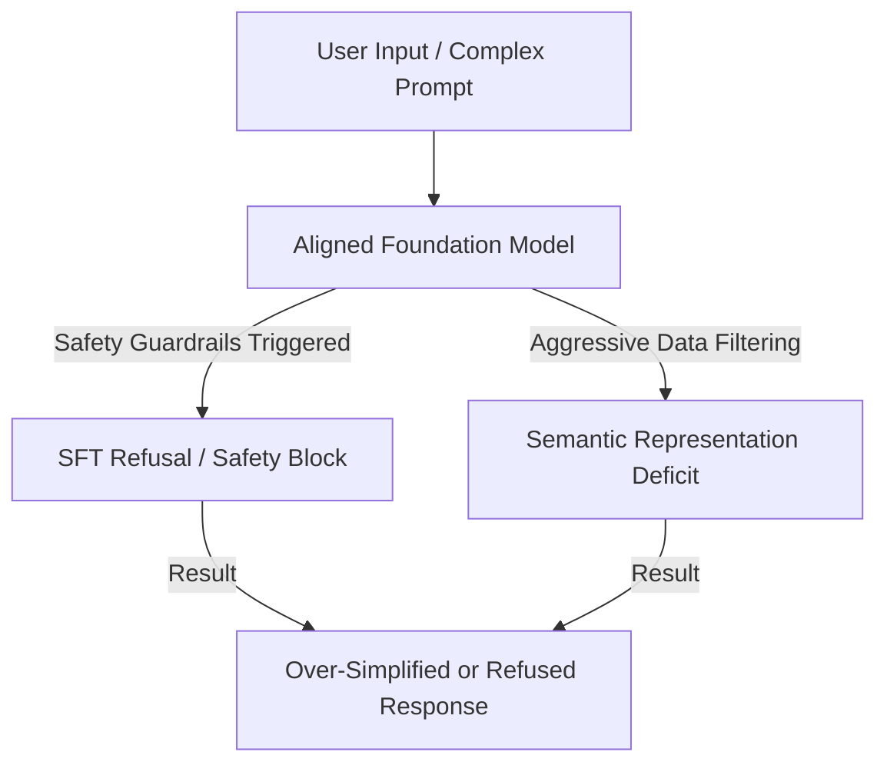

# The Modern Alignment & Foundation Scaling Era (~2021–Present)

In the era of large foundation models, underfitting has evolved. Models have billions of parameters and immense latent capacity, yet they can still underfit due to training bottlenecks, data starvation, and safety alignment constraints.

## Key Mechanisms & Constraints
* **Compute-Optimal Scaling Bottlenecks:** Under-training models relative to their scaling laws (e.g., training a massive model on too few tokens).
* **Alignment-Induced Underfitting (Over-Alignment):** Strict safety guardrails during Supervised Fine-Tuning (SFT) or RLHF cause the model to refuse benign prompts or over-simplify complex instructions.
* **Aggressive Data Filtering:** Token-filtering regimes that strip out valuable technical or mathematical edge cases, starving the model of specialized reasoning capacity.

## Diagram

## Mitigation
Modern engineering protocols to resolve this include:
1. **DPO / RLHF Calibration:** Fine-tuning alignment boundaries to differentiate between genuinely harmful prompts and complex benign prompts.
2. **Pre-training Scale Extension:** Training on trillions of high-quality tokens beyond compute-optimal boundaries.

---
[← Back to README](../README.md)
