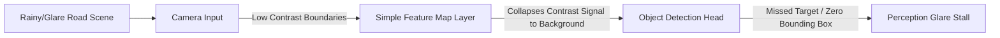

# Autonomous Driving Perception System Glare Stalls

Autonomous vehicle perception pipelines underfit real-world dynamics when their convolutional or transformer-based object-detection heads fail to extract subtle features under adverse visual conditions.

## Key Mechanisms & Constraints
* **Low Contrast Underfitting:** During high-glare events (e.g., direct sunlight or midnight headlight reflections off wet roads), target objects (like pedestrians or cyclists) have extremely low contrast boundaries.
* **Simplistic Feature Extraction:** If the network has insufficient depth or too few channels, the feature maps collapse these low-contrast signals into background noise, failing to detect obstacles.
* **Failure on Rare Covariate Shifts:** The model's learned representation of pedestrians assumes clear conditions, failing to generalise to wet/rainy visual distortions.

## Diagram

## Mitigation
1. **Multi-Modal Fusion:** Combine camera feeds with LiDAR and Radar inputs that are unaffected by visual glare.
2. **Contrast-Invariant Training:** Train models using synthetic glare simulation and contrast-normalization augmentation layers.

---
[← Back to README](../README.md)
