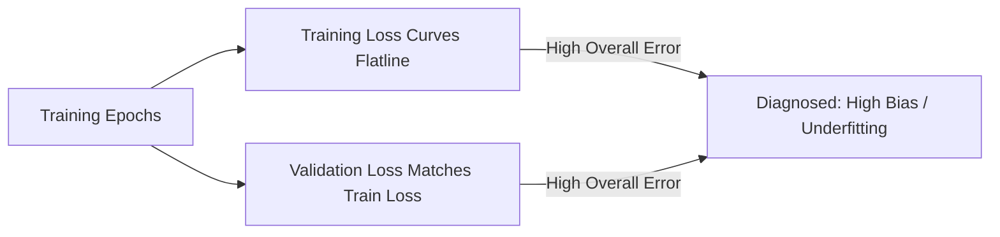

# The Bias-Variance Diagnostic Matrix

The **Bias-Variance Diagnostic Matrix** is a production diagnostic framework used to identify underfitting by analyzing the relationship between training error and validation/testing error.

## Key Diagnostic Signals
* **High Training Error:** The baseline indicator. If the training error is unacceptably high relative to the target error rate, the model is underfitting.
* **Low Train-Val Gap:** The hallmark signature of underfitting. Unlike overfitting (where validation error is high but training error is low), underfitting results in both errors remaining high and close to one another.
* **Metric Plateaus:** Extended training runs where the training loss curves flatline prematurely.

## Diagram

## Matrix Representation
| Metric State | Diagnosis | Primary Cause | Solution |
| :--- | :--- | :--- | :--- |
| High Train Error + High Val Error | **Underfitting** | Low Model Capacity | Scale up model parameters or extend training |
| Low Train Error + High Val Error | **Overfitting** | High Variance / Over-parameterized | Add regularization or ingest more data |
| Low Train Error + Low Val Error | **Optimal Fit** | Balanced Capacity & Regularization | Deploy to Production |

---
[← Back to README](../README.md)
