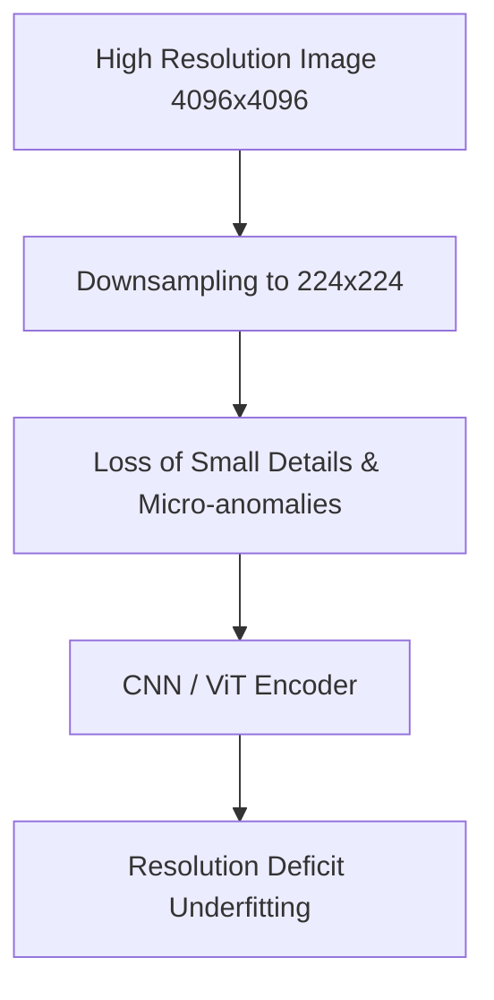

# Computer Vision Resolution Deficit

**Computer Vision Resolution Deficit** refers to underfitting caused by aggressively downsampling images (e.g., to standard $224 \times 224$ patches) before training a vision model.

## Key Mechanisms & Constraints
* **High-Frequency Information Loss:** Granular textual details, distant objects, and micro-anomalies are blurred out during downsampling.
* **Feature Extractor Saturation:** The early convolutional or patch embedding layers cannot reconstruct patterns that are sub-pixel scale in the input.
* **Spatial Aggregation Errors:** Downscaled bounding boxes lose spatial accuracy, leading to poor regression on object borders.

## Diagram

## Mitigation
1. **High-Resolution Patching:** Train models on native, uncompressed image patches using sliding-window approaches.
2. **Multi-scale Feature Pyramids:** Utilize feature pyramid networks (FPN) to fuse early high-resolution features with deep low-resolution features.

---
[← Back to README](../README.md)
