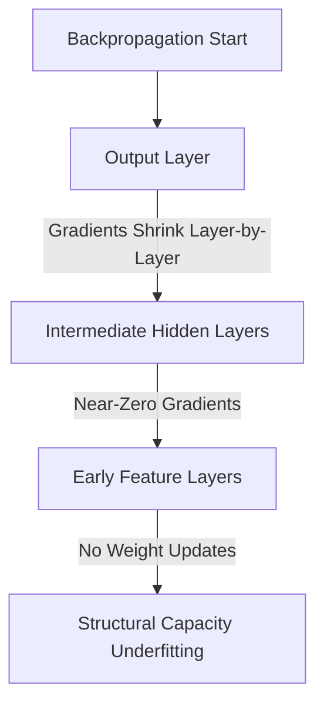

# The Deep Learning Structural Capacity Era (~2012–2020)

With the rise of deep neural networks, underfitting transitioned from a limitation of simple equations to optimization and capacity bottlenecks. While deep models have the theoretical capacity to represent any function (per the Universal Approximation Theorem), actually training them successfully presents unique optimization challenges.

## Key Mechanisms & Constraints
* **Vanishing Gradients:** As gradients propagate backward through many layers, they shrink exponentially, leaving early layers virtually untrained and underfit.
* **Aggressive Regularization:** Starving the network of capacity via excessive dropout rates ($>0.5$) or massive weight decay.
* **Sub-optimal Initialization:** Poor weight initialization (e.g., all zeros or unscaled values) leading to dead neurons or slow optimization progress.

## Diagram

## Mitigation
Key developments during this era to fix underfitting included:
1. **Residual Connections:** Introducing skip connections (ResNet) to allow gradients to flow directly back.
2. **Batch Normalization:** Standardizing activations across mini-batches to prevent saturation.
3. **Advanced Optimizers:** Moving from basic SGD to adaptive optimizers like Adam and RMSprop.

---
[← Back to README](../README.md)
