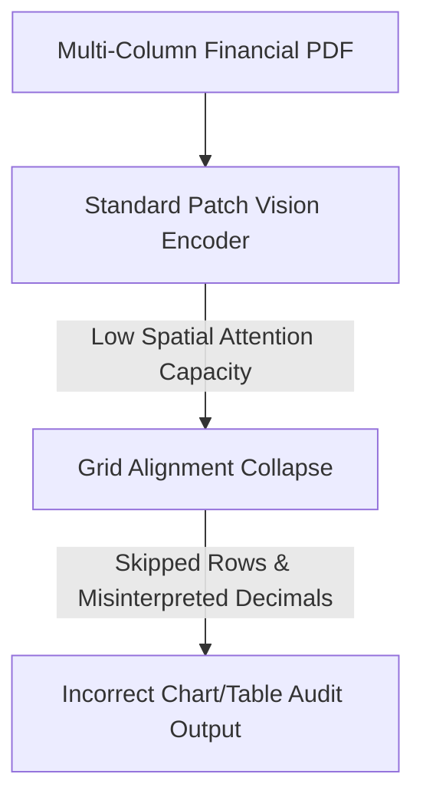

# Automated Document Layout & Chart Auditing Failures

When financial institutions or audit networks deploy multimodal models to analyze complex multi-column PDFs, tables, and charts, underfitting manifests as structural parsing errors.

## Key Mechanisms & Constraints
* **Spatial Attention Bottlenecks:** Standard vision-language models use low-resolution patch encoders that miss line breaks, small decimal separators, and intersecting gridlines.
* **Layout Grid Collapse:** The spatial coordinate projections underfit the complex, non-standard layout flow, leading to missing text sections.
* **Coordinate Mapping Drift:** Relational mappings between text labels and bar chart heights are misaligned because the model's coordinate heads are too simple.

## Diagram

## Mitigation
1. **Dynamic Resolution ViTs:** Use architectures like Pix2Struct or Donut that dynamically scale patch layouts based on image aspect ratio.
2. **2D Position Embeddings:** Incorporate explicit 2D spatial coordinate embeddings in early transformer layers to preserve document structure.

---
[← Back to README](../README.md)
