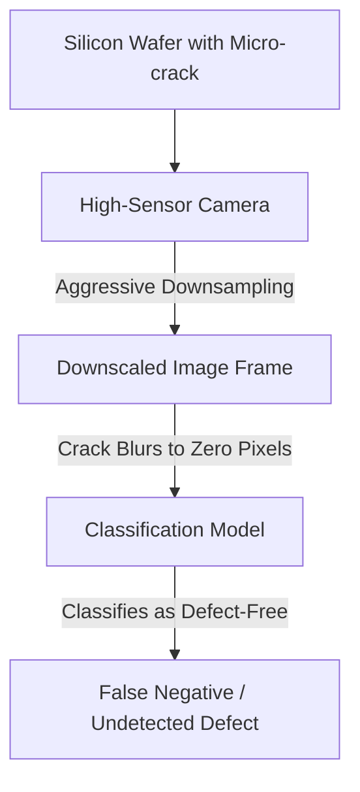

# Industrial Defect Screening Pipelines

High-speed camera lines monitoring manufacturing lines for defects (e.g., micro-fractures in silicon wafers or solder joint anomalies on PCBs) frequently experience massive false-negative streams due to underfitting.

## Key Mechanisms & Constraints
* **Sub-Pixel Defect Scale:** Anomalies are often microscopic, occupying only a few pixels on a high-resolution canvas.
* **Resolution Bottleneck:** Downsampling full-sensor image frames to match the model's standard input dimensions blurs out the defect.
* **Insufficient Class-Capacity:** The model's representations are optimized for common defects, underfitting rare or novel anomaly variants.

## Diagram

## Mitigation
1. **Uncompressed Tiling:** Process the image by split-tiling the high-resolution frame into smaller patches and feeding each patch to the model natively.
2. **Anomaly Detection with Reconstruction:** Deploy reconstruction-based autoencoders (like MVTec AD models) to flag any local deviation from normal wafer templates.

---
[← Back to README](../README.md)
