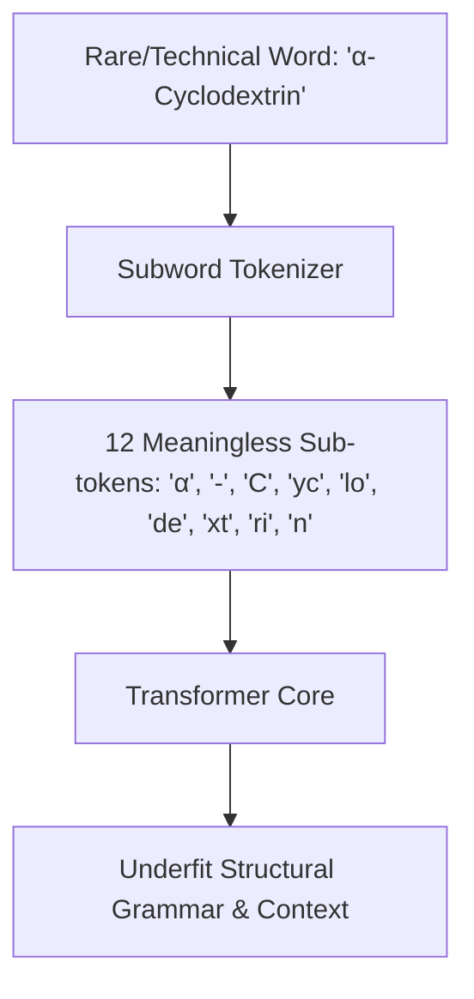

# Natural Language Processing Representation Underfitting

**NLP Representation Underfitting** occurs when a model cannot capture language structure due to tokenization constraints, token vocabulary mismatches, or context window constraints.

## Key Mechanisms & Constraints
* **Excessive Subword Fragmentation:** Tokenizers splitting rare or technical words (like non-English scripts or code) into dozens of individual byte tokens. This stretches the sequence length, making semantic relationships span beyond the model's effective attention span.
* **Out-of-Vocabulary (OOV) Mappings:** Collapsing unique entities into generic `<unk>` tokens, causing the model to underfit rare concepts.
* **Positional Embedding Decay:** Transformers failing to track structural context over long distances.

## Diagram

## Mitigation
1. **Custom Vocabulary Pre-training:** Retrain tokenizers on domain-specific corpora (e.g., legal, clinical, or code repositories) to maintain semantic integrity.
2. **Byte-level Tokenizers:** Use tokenizers that group bytes more efficiently and scale down context fragmentation.

---
[← Back to README](../README.md)
