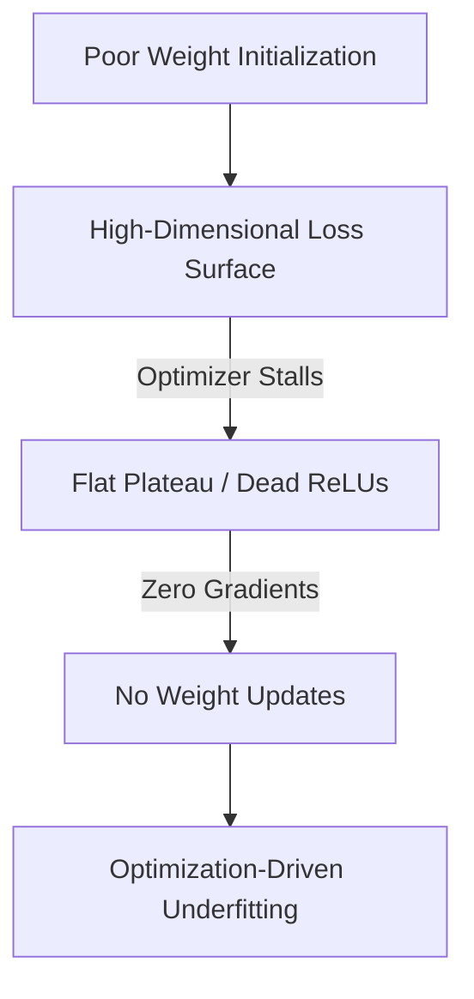

# Optimization-Driven Underfitting

**Optimization-Driven Underfitting** occurs when a model possesses sufficient structural capacity (neurons/layers) on paper, but the training algorithm fails to find a deep local minimum during the optimization process.

## Key Mechanisms & Constraints
* **Sub-optimal Learning Rates:** A learning rate that is too high causes the model to bounce around the loss surface; a rate too low causes the model to stall.
* **Dead Zones & Saddle Points:** Weights get stuck in regions of near-zero gradients (e.g., dead ReLUs).
* **Poor Initialization:** Starting weights do not match the layer scale, leading to gradient explosion/decay immediately.

## Diagram

## Mitigation
1. **Adaptive Optimization:** Use AdamW or Adafactor to dynamically scale step sizes.
2. **Learning Rate Schedulers:** Deploy cosine annealing with warmups.
3. **Activation Functions:** Swap standard ReLUs for Leaky ReLUs or GELU to avoid dead activations.

---
[← Back to README](../README.md)
