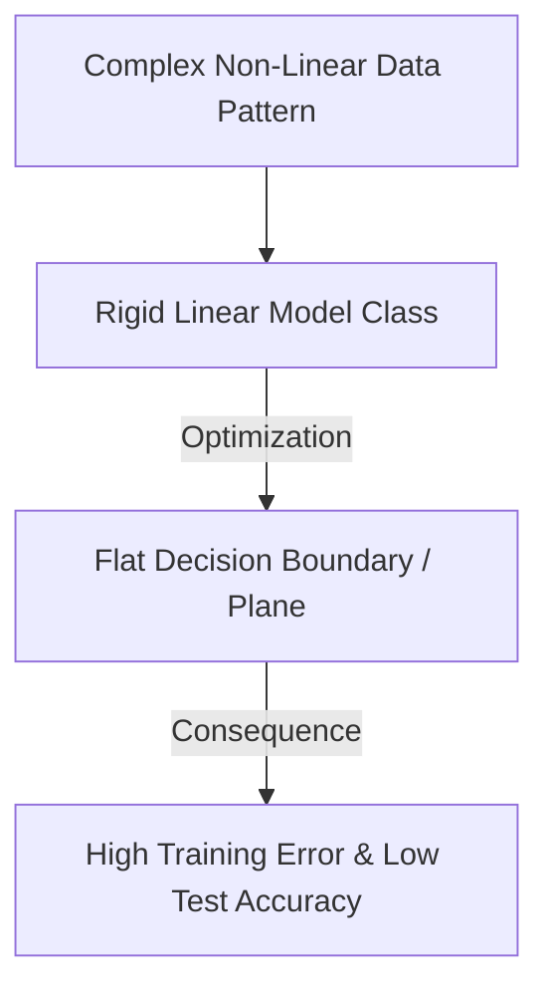

# The Parametric Linear Limits Era (Traditional ML)

The **Parametric Linear Limits Era** represents the classical phase of machine learning where underfitting was primarily a consequence of high-bias, low-capacity model design. In this era, models were defined by rigid mathematical assumptions (e.g., linearity, additivity) that could not match the complexity of real-world datasets.

## Key Mechanisms & Constraints
* **High Bias, Low Variance:** The model's hypothesis class was too small, assuming simple linear boundaries for highly non-linear problems.
* **Geometric Inflexibility:** Models like simple linear regression or logistic regression without polynomial features flatlined because they could only draw flat planes or lines, missing complex curves in the data space.
* **Under-Parameterization:** Having too few parameters relative to the size and dimensionality of the dataset.

## Diagram

## Mitigation
To resolve underfitting in this era, developers:
1. Engineered non-linear features (e.g., polynomial expansions, interaction terms).
2. Switched to non-parametric models (e.g., decision trees, support vector machines with kernel tricks).

---
[← Back to README](../README.md)
