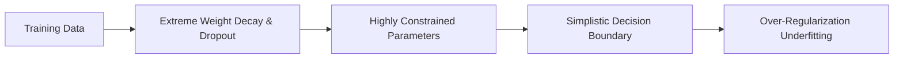

# Regularization-Induced Underfitting (Over-Regularization)

**Regularization-Induced Underfitting** occurs when regularization techniques are applied too aggressively, restricting the network's flexibility and parameters to the point where it can no longer learn the true training signal.

## Key Mechanisms & Constraints
* **Excessive Weight Decay ($L_2$):** Penalizing the loss function too heavily for large weights, forcing parameters to stay near zero.
* **Aggressive Dropout:** Disabling too many nodes ($>0.5$) during each training step, starving the network of feature pathways.
* **Extreme Data Augmentation:** Adding so much noise or warping to the training data that the model cannot extract clean, stable representation rules.

## Diagram

## Mitigation
1. **Regularization Relaxation:** Gradually lower weight decay parameters and drop rates.
2. **Dynamic Regularization Schedulers:** Start with lower regularization and increase it as the training process progresses.

---
[← Back to README](../README.md)
