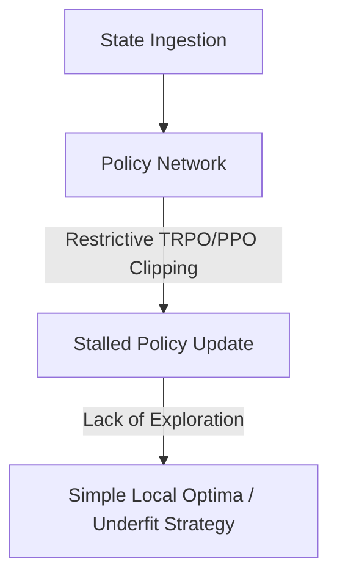

# Reinforcement Learning Policy Convergence Stalls

In Reinforcement Learning, **Policy Convergence Stalls** represent a form of underfitting where the policy network fails to explore or model the optimal state-action transition distribution of the environment.

## Key Mechanisms & Constraints
* **Restrictive Trust Regions:** In algorithms like PPO or TRPO, setting clipping parameters ($\epsilon$) too narrow prevents policy updates from escaping poor local optima.
* **Entropy Starvation:** When the policy's action distribution entropy drops too early, exploration stops, and the agent converges to a simplistic, suboptimal strategy.
* **Reward Credit Assignment Failures:** The network fails to map early actions to delayed rewards, underfitting the temporal structure of the task.

## Diagram

## Mitigation
1. **Entropy Regularization:** Add an entropy bonus to the loss function to encourage continuous exploration of alternative action paths.
2. **Dynamic Clipping Windows:** Allow the policy trust-region bounds to scale based on gradient variance.

---
[← Back to README](../README.md)
