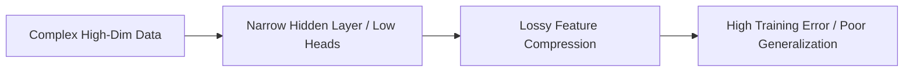

# Structural Capacity Underfitting

**Structural Capacity Underfitting** occurs when a neural network model's architecture is physically too small to learn or store the complexity of the data distribution.

## Key Mechanisms & Constraints
* **Low Parameter Count:** Insufficient neurons, layers, or attention heads to construct the necessary decision boundaries.
* **Low Dimensionality:** Embedding dimensions are too narrow, causing lossy compression of key semantic features.
* **Universal Approximation Failures:** The network's representational boundaries are mathematically bounded by its size, preventing it from tracking high-frequency signals.

## Diagram

## Mitigation
1. **Network Width/Depth Scaling:** Increase embedding dimensions, attention heads, or hidden layers.
2. **Architecture Transition:** Move to more expressive foundation backbones (e.g., from small CNNs to Vision Transformers).

---
[← Back to README](../README.md)
