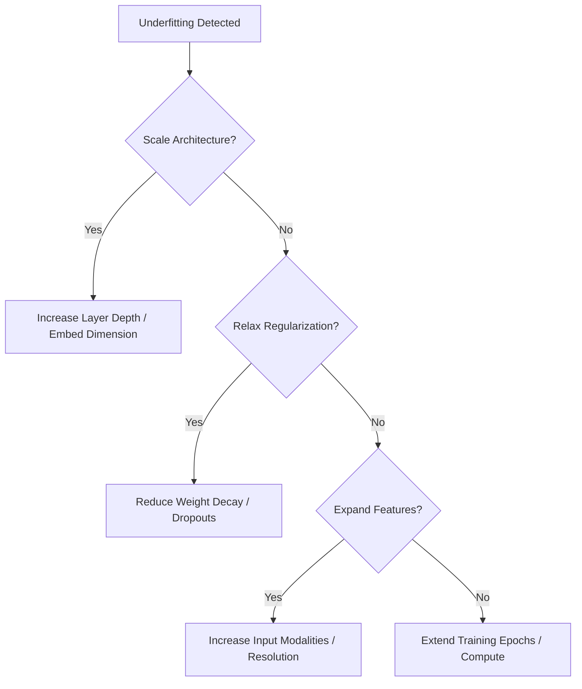

# Systemic Engineering Mitigations

Resolving underfitting in live, commercial model-building infrastructure requires deploying systemic, automated pipeline adjustments.

## Core Mitigations
1. **Architecture Scaling:** Shifting the underlying model wrapper to a wider, deeper configuration (e.g., from an 8B model to a 32B model, or adding layers to a convolutional neural network).
2. **Feature Ingestion Expansion:** Creating interaction terms, concatenating auxiliary tables, or providing uncompressed, higher-resolution inputs.
3. **Regularization Relaxation:** Reducing Weight Decay parameters, dropping dropout probabilities, and simplifying data augmentation steps.
4. **Extending Training Horizons:** Increasing epoch count, using a more gradual decay scheduler, or increasing test-time thinking budget.

## Diagram

---
[← Back to README](../README.md)
